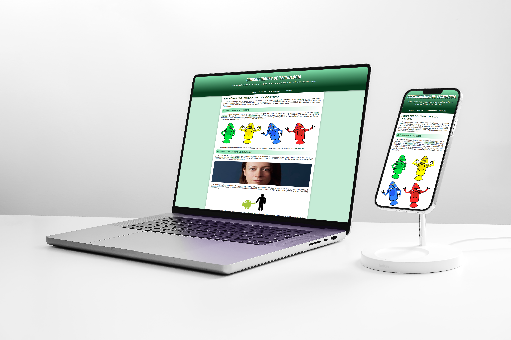
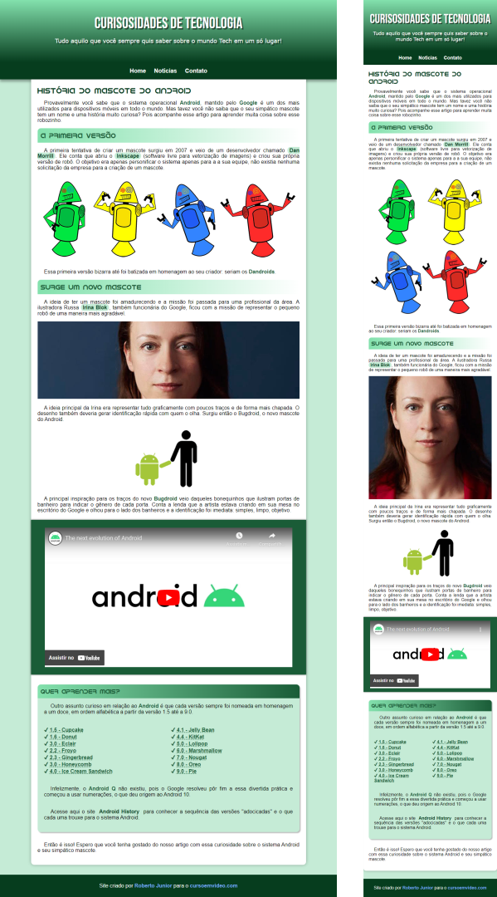

# projeto-android
Site criado no exercício 17 do Curso em Video de HTML e CSS

Acesse o link do <a target="_blank" href="https://robertojunnior.github.io/projeto-android/">Projeto.</a>

Abaixo as imagens do site responsivo versão Desktop e Mobile.

 

    

 
 
    
    

